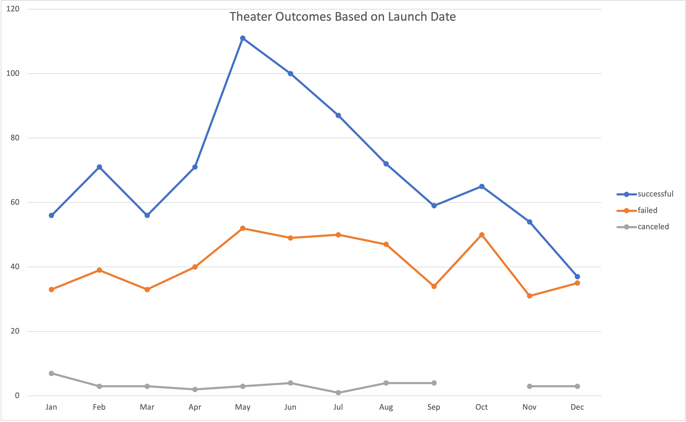
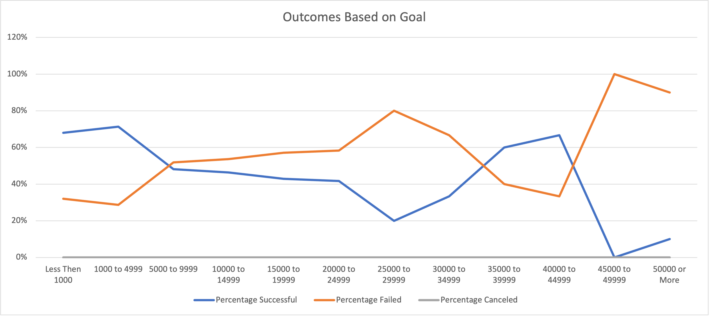

# Kickstarting with Excel

## Overview of Project

    The massively successful crowdfunding service Kickstarter has raised over $2 billion, but not all projects succeed. Of his over 300,000 projects launched on Kickstarter, only one-third have made it through the funding process with positive results.

    To be funded on Kickstarter, your project must meet or exceed its original goals. As a result, many organizations spend months sifting through past projects to find the secret to success. This project organized and analyzed a database of 4,000 past projects, using conditional formatting and pivot tables to uncover hidden trends.

### Purpose

    The purpose of the this challenges is to enhance the analytical skill usign Microsoft Execl 

## Analysis and Challenges

### Analysis of Outcomes Based on Launch Date

_______

### Analysis of Outcomes Based on Goals

_____
### Challenges and Difficulties Encountered

## Results

- What are two conclusions you can draw about the Outcomes based on Launch Date?

   - In May, there is more than a 100% success rate.
    - In October, there is a 50% field rate.
    - April, where there is more than a 60% success rate.
    - The worst month to start a campaign is December, where there is a less than 40% success rate.

    _________

- What can you conclude about the Outcomes based on Goals?

- What are some limitations of this dataset?

- What are some other possible tables and/or graphs that we could create?

    - Number of Campaigns by Country
